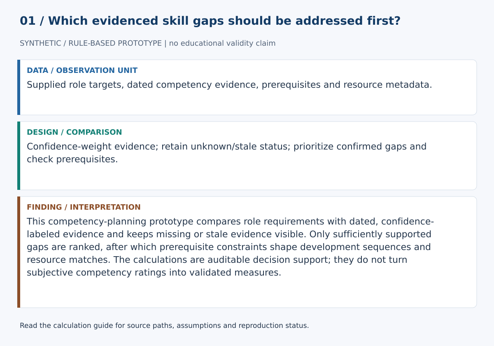
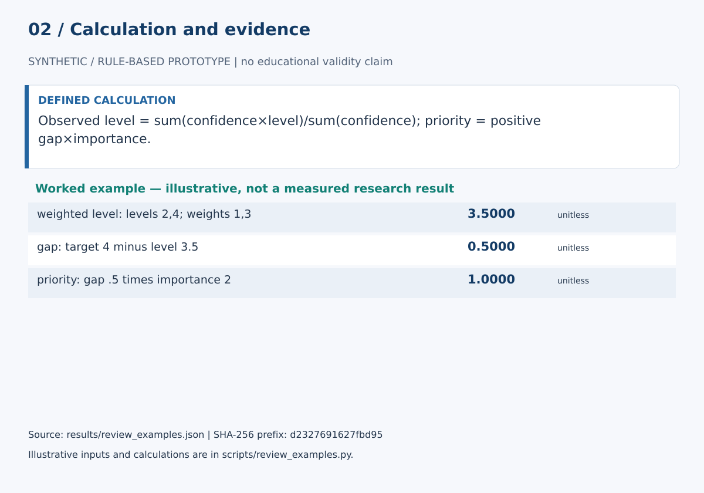

# Competency Gap Intelligence

This competency-planning prototype compares role requirements with dated, confidence-labeled evidence and keeps missing or stale evidence visible. Only sufficiently supported gaps are ranked, after which prerequisite constraints shape development sequences and resource matches. The calculations are auditable decision support; they do not turn subjective competency ratings into validated measures.

## Start here

- [Calculations, evidence and verification scope](CALCULATIONS.md)
- [Figure sources and exact numerical paths](docs/figure_spec.json)
- [Data status](data/README.md)





**Review scope:** 32 existing unittest checks passed. The bundled demonstration executed successfully in this review.

## Detailed project documentation

> Evidence-aware competency gap analysis with prerequisite sequencing, explainable resource matching, and ranking sensitivity.

[](https://github.com/devissaputra/competency_gap_intelligence/actions/workflows/ci.yml)


**Area:** Learning & Development · Competency Intelligence · Workforce Development  
**Status:** working research prototype  
**Author:** Devis Saputra

## What this project is for

Competency systems often make a dangerous simplification:

> no competency record = no competency.

This repository explicitly avoids that assumption.

Competency Gap Intelligence separates:

- what a role requires
- what evidence exists
- how strong and recent that evidence is
- whether a gap is actually confirmed
- which prerequisite skills block progression
- which resources match the learner's current and target levels
- how sensitive the priority order is to role-importance assumptions

The output is designed to support development planning, not performance scoring.

## Core design rule

**Missing evidence is not proficiency zero.**

A competency can be classified as:

- `gap`
- `met`
- `exceeds_target`
- `unknown_evidence`
- `insufficient_evidence`

Only confirmed gaps receive a numeric development priority.

Unknown or weak evidence triggers assessment/review instead of automatic training.

## Research questions

1. How should role requirements and demonstrated evidence be represented on an explicit scale?
2. How should missing, stale, or low-confidence evidence change gap analysis?
3. Which confirmed gaps remain high priority under different importance assumptions?
4. How should prerequisite competencies affect development order?
5. Which learning resources match the learner's current level, target level, and prerequisite state?
6. Which recommendations are stable enough to support human review?

## End-to-end workflow


The implemented path is:

1. declare a proficiency scale
2. define role requirements
3. collect competency evidence with provenance
4. aggregate multiple evidence records
5. classify each competency
6. rank confirmed gaps
7. identify prerequisite blockers
8. sequence development needs
9. match structured resources
10. test ranking sensitivity under alternative importance scenarios

## Declared proficiency scale

Every analysis requires a named scale with:

- minimum
- maximum

The synthetic demo uses a 0–5 scale, but the code does not assume that all competency frameworks use those numbers.

That matters because frameworks such as SFIA and O*NET define their own level structures and anchors.

A number without its scale definition is not a meaningful competency statement.

## Role requirements

A role competency can include:

- target proficiency
- importance
- framework/source
- rationale

Example:

```python
{
    "statistics": {
        "target": 3,
        "importance": 1.4,
        "framework": "synthetic role profile",
        "rationale": "Required before advanced learning-analytics work."
    }
}
```

Importance affects priority only after a gap is supported by adequate evidence.

## Competency evidence

Evidence records can include:

- competency
- observed level
- source
- evidence type
- confidence
- observation date
- assessor

Multiple observations are combined using a transparent confidence-weighted mean.

The aggregation also records:

- evidence count
- mean confidence
- latest observation date
- evidence age
- stale flag
- sources
- evidence types
- assessors

This is deliberately inspectable. It is not presented as a psychometric model.

## Missing and insufficient evidence

If no usable evidence exists:

```text
status = unknown_evidence
current = None
gap = None
priority = None
action = collect_evidence
```

If evidence exists but is stale or below the configured confidence threshold:

```text
status = insufficient_evidence
priority = None
action = review_evidence
```

The system therefore does not manufacture a large gap merely because a competency was never assessed.

## Confirmed gap priority

For a sufficiently supported gap:

```text
gap = target - observed
priority = gap × importance
```

Negative gaps are not treated as deficits.

A competency above target receives:

```text
status = exceeds_target
gap = 0
```

The priority formula is simple on purpose. The repository also exposes ranking sensitivity so that the effect of changing importance assumptions is visible.

## Prerequisite intelligence

A competency dependency can be declared explicitly:

```text
learning_analytics
      ↑
  statistics
```

The prerequisite engine:

- rejects unknown competencies
- rejects self-dependencies
- rejects cycles
- identifies unresolved blockers
- places prerequisites before dependent gaps

This means a large advanced gap does not automatically outrank a missing foundation.

## Structured resource matching

The original prototype attached the first three resources stored under a competency name.

That has been replaced.

Each learning resource now declares:

- id
- title
- competency
- entry level
- target level
- effort hours
- modality
- competency prerequisites

A candidate is matched only when:

- the competency is a confirmed gap
- the current level meets the resource entry level
- the resource advances beyond the current level
- its declared competency prerequisites are already met

Resources are ordered transparently by:

1. whether they reach the role target
2. amount of gap coverage
3. lower effort
4. deterministic title tie-breaker

No hidden recommender model is involved.

## Development path

`build_development_plan()` produces an ordered plan with four possible actions:

- `collect_evidence`
- `review_evidence`
- `develop`
- `no_development_required`

Each plan item includes:

- competency
- status
- current and target level
- gap and priority where valid
- prerequisite blockers
- matched resources
- rationale

## Ranking sensitivity

`ranking_sensitivity()` compares gap order across alternative importance-weight scenarios.

It reports:

- ranking under each scenario
- best rank
- worst rank
- whether the rank stayed stable

A priority that moves dramatically when reasonable role weights change should be treated as a planning assumption, not an objective fact.

## Synthetic demo


The bundled example includes seven competencies and deliberately covers several different conditions:

- multiple evidence sources
- a confirmed foundation gap
- a dependent advanced gap
- one competency above target
- one competency with no evidence
- one low-confidence self-report
- one stale evidence record
- structured learning resources
- a prerequisite dependency
- alternative importance scenarios

The example is synthetic. It is designed to exercise the software path, not to describe a real employee.

## Data

The repository includes:

- `data/sample.csv` — synthetic evidence records
- `data/role_profile.json` — synthetic role requirements and scale
- `data/prerequisites.json` — synthetic prerequisite graph
- `data/resources.json` — structured synthetic development resources
- `data/README.md` — schema, evidence, governance, and scale documentation

## Run the demo

```bash
git clone https://github.com/devissaputra/competency_gap_intelligence.git
cd competency_gap_intelligence
python scripts/run_demo.py
python -m unittest discover -s tests -v
```

The current baseline uses only the Python standard library.

## Core API

`validate_scale(...)` validates a declared proficiency scale.

`validate_requirements(...)` validates role requirements and importance.

`aggregate_evidence(...)` combines multiple evidence records while preserving provenance and recency.

`competency_gaps(...)` classifies each competency without converting missing evidence to zero.

`validate_prerequisites(...)` validates the dependency graph and rejects cycles.

`prerequisite_blockers(...)` identifies unresolved foundations.

`development_sequence(...)` orders prerequisite and downstream needs.

`validate_resources(...)` validates structured development resources.

`match_resources(...)` matches resources only to confirmed, level-compatible gaps.

`build_development_plan(...)` creates the explainable assessment/development path.

`ranking_sensitivity(...)` compares confirmed-gap rankings across importance scenarios.

## Evaluation view


The evaluation graphic is a checklist, not a measured result.

A real study should validate:

- role-profile quality
- proficiency evidence quality
- scoring reliability
- prerequisite validity
- resource relevance
- learning impact
- ranking robustness
- fairness in opportunity to demonstrate competency

## Framework context

The implementation is intentionally framework-agnostic.

Useful external reference systems include:

- ESCO for occupation–skill relationships
- O*NET for structured worker/job content, scales, and level anchors
- SFIA for digital professional skills and levels of responsibility

The repository does not copy or redistribute those frameworks.

See `docs/related_work.md`.

## Limits and responsible use

This repository does **not**:

- infer competency from employee behavior
- validate a competency framework
- prove that an observed score is reliable
- estimate potential
- prove that a resource will close a gap
- estimate causal training impact
- recommend employment actions

A numerical competency difference is only as credible as the framework, scale, evidence, and opportunity to demonstrate the skill.

Do not use this prototype alone for hiring, promotion, termination, pay, discipline, or performance ratings.

See `docs/ethics_and_risks.md`.

## Repository map

```text
.
├── .github/workflows/ci.yml
├── assets/
│   ├── architecture.svg
│   ├── data_flow.svg
│   ├── demo_snapshot.svg
│   └── evaluation_dashboard.svg
├── data/
│   ├── README.md
│   ├── sample.csv
│   ├── role_profile.json
│   ├── prerequisites.json
│   └── resources.json
├── docs/
│   ├── ethics_and_risks.md
│   ├── related_work.md
│   └── research_protocol.md
├── reports/model_card.md
├── scripts/run_demo.py
├── src/competency_gap_intelligence/core.py
├── tests/test_core.py
├── .gitignore
├── CITATION.cff
├── LICENSE
├── pyproject.toml
└── README.md
```

## Research path

A stronger empirical version would:

1. connect to a versioned competency framework
2. define anchored proficiency rubrics
3. validate role requirements with multiple job experts
4. measure rater/scoring reliability
5. model uncertainty in proficiency estimates
6. validate prerequisite relationships
7. compare resource matching with expert L&D recommendations
8. test whether development resources improve independent competency evidence
9. evaluate opportunity-to-demonstrate bias
10. compare the transparent baseline with learned recommendation methods

## Citation and license

`CITATION.cff` contains the software citation. Code and original SVG visuals use the MIT License. External competency frameworks and datasets retain their own licenses and usage terms.
