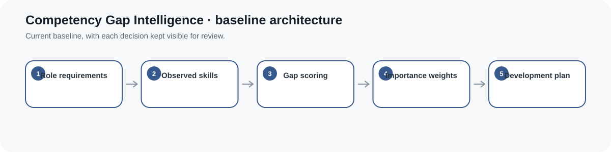
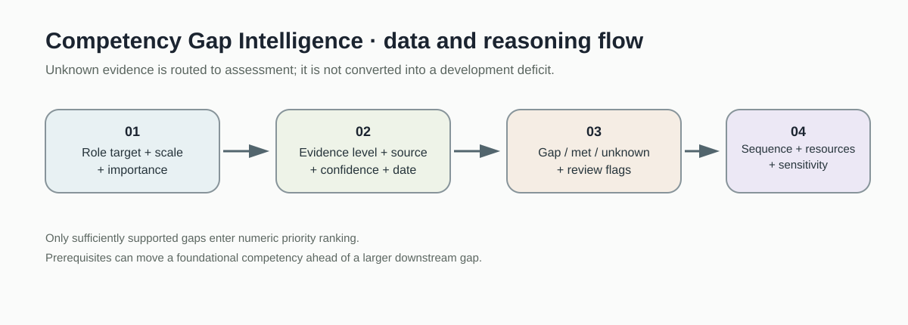
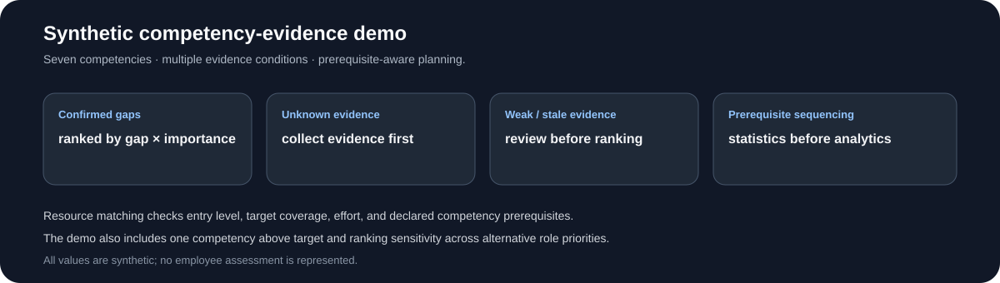
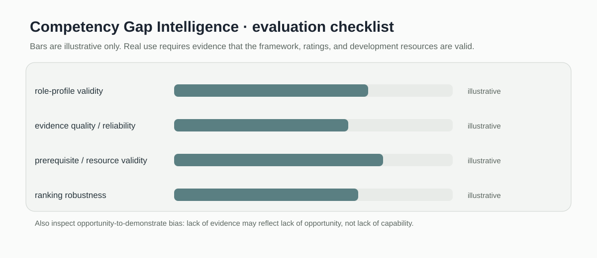

# Competency Gap Intelligence

> Skill gap scoring and resource planning baseline for workplace capability development.

[](https://github.com/devissaputra/competency-gap-intelligence/actions/workflows/ci.yml)



**Area:** Workplace Learning & Capability Development    
**Status:** working research prototype  
**Author:** Devis Wawan Saputra

## What this project is for

This prototype compares the skills a role requires with the skills a learner or employee currently demonstrates. It ranks positive gaps by size and optional importance, then links those gaps to a small set of development resources.

**Who may find it useful:** L&D teams, workforce-development researchers, and instructional designers building competency-based development paths.

## Research questions

1. How can role requirements and observed proficiency be represented transparently?
2. Which development actions close the highest-value gaps first?
3. How should prerequisite competencies influence recommendations?

## How it works

The prototype compares required and observed skill levels, clips negative gaps to zero, applies optional importance weights, and sorts the results into a development priority list. A second function attaches up to three candidate resources to each positive gap.



The implemented path is straightforward: role requirements and observed evidence become weighted gaps, then those gaps are linked to available development resources. No prerequisite graph is inferred in the current baseline.



This snapshot shows the bundled synthetic example for Competency Gap Intelligence. It checks the software path; it is not an empirical performance result.

## Methods in the current baseline

- competency gap calculation
- importance weighting
- priority ranking
- resource attachment
- development plan generation

## Data

Synthetic role profiles and competency ratings are included.

`data/README.md` documents the sample schema and the conditions that should be recorded before any real dataset is connected. Restricted or identifiable learner data should stay outside the repository.

## Run the demo

```bash
git clone https://github.com/devissaputra/competency-gap-intelligence.git
cd competency-gap-intelligence
python scripts/run_demo.py
python -m unittest discover -s tests -v
```

The demo uses two competencies and prints their gap size and priority. It is intentionally small so the ranking logic can be checked without a proprietary skills platform.

## What to evaluate next

The next useful test is whether the gap scores agree with independent evidence from work samples, assessments, or manager review. Resource recommendations should then be evaluated for relevance and actual skill improvement.

## Evaluation view



The Competency Gap Intelligence dashboard is an evaluation checklist rather than a result chart. The bars are illustrative only; the labels show the evidence a real study would need to collect.

## Limits and responsible use

A numerical gap is only as credible as the competency framework and evidence behind it. The current code does not infer skills from employee behavior and should not be used for performance decisions. See `docs/ethics_and_risks.md` for the broader risk review.

## Repository map

```text
.
├── .github/workflows/ci.yml
├── assets/
│   ├── architecture.svg
│   ├── data_flow.svg
│   ├── demo_snapshot.svg
│   └── evaluation_dashboard.svg
├── data/
│   ├── README.md
│   └── sample.csv
├── docs/
│   ├── ethics_and_risks.md
│   ├── related_work.md
│   └── research_protocol.md
├── reports/model_card.md
├── scripts/run_demo.py
├── src/competency_gap_intelligence/core.py
├── tests/test_core.py
├── CITATION.cff
├── LICENSE
├── pyproject.toml
└── README.md
```

## Research path

A credible next version would:

1. connect gaps to evidence with clear provenance
2. compare rankings with expert competency review
3. measure whether recommended practice closes the targeted gap

## Related work

`docs/related_work.md` points to open projects that are relevant to this problem area. They are context for comparison and study design; this repository does not present their code as its own.

## Citation and license

`CITATION.cff` contains the software citation. The code and original SVG visuals use the MIT License. Any external dataset keeps its own license and usage conditions.
